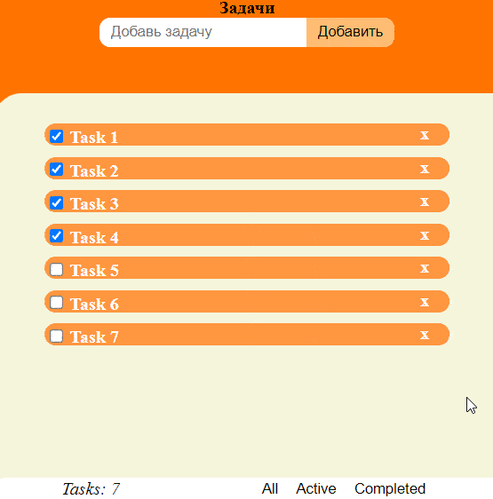

# ToDo Web App  

Функционал:
-   Добавление задачи
-   Удаление задачи
-   Редактирование задачи
-   Возможность отметить задачу выполненной/активной
-   Три фильтра по задачам All (все), Active (активные), Completed (выполненные)
-   Счетчик всех задач
-   Задачи и их статусы сохраняются в БД PostgreSQL через операции с моделями
-   При перезагрузке страницы отображаются задачи из БД
-   Добавление, удаление, отметка задачи производится через Ajax запросы на JavaScript

---
# Демонстрация работы

